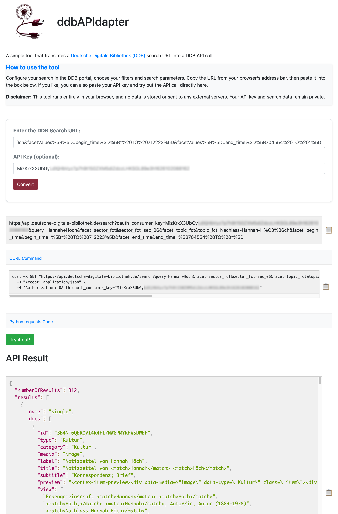

  <h1>ddbAPIdapter</h1>

ddbAPIdapter is a simple web tool that converts a search URL from the [Deutsche Digitale Bibliothek (DDB)](https://www.deutsche-digitale-bibliothek.de) into a corresponding DDB API call. This allows users to translate their search queries into API requests and test them out easily.

## Features

- **Convert DDB search URLs to API Calls:** Automatically converts valid search URLs from the DDB into corresponding API requests.
- **API Key Input:** Users can optionally provide an API key to execute the API call.
- **Interactive Try It Out Button:** Once the API URL is generated, users can run the call and see the API response directly on the webpage.
- **Copy to Clipboard:** The generated API URL can be copied with a single click.

## Demo



You can try the tool [here](https://alexander-winkler.github.io/ddbAPIdapter) by providing a DDB search URL, and the tool will generate an API URL for you. If you provide a valid API key, you can even run the request and see the results.

## Getting Started

### Prerequisites

To run this project, you simply need a modern web browser like Chrome, Firefox, or Edge.

### Installation

1. Clone this repository to your local machine:

    ```bash
    git clone https://github.com/yourusername/ddbAPIdapter.git
    ```

2. Open the `index.html` file in your browser.

### Usage

1. Open the `index.html` file in any browser.
2. Input a valid **DDB search URL** in the "URL" input box.
3. (Optional) Input an **API Key** if you want to execute the API request.
4. Click the **Convert** button to generate the corresponding DDB API call.
5. Copy the generated API URL or click **Try it out!** to run the API call and see the response.

## Technical Details

- **HTML5, JavaScript**: Core functionality to input the DDB search URL, handle the conversion, and process the API request.
- **Bootstrap 4**: For styling and responsive design.
- **Fetch API**: Used to make API requests to the DDB API endpoint.
- **Clipboard API**: Allows easy copying of the generated API URL.
- **Error Handling**: Alerts the user if no API key is provided or if there is an error during the API request.

## File Structure

```plaintext
├── index.html      # The main HTML file that contains the form and logic
└── README.md       # This file
```

## Credits

This application was created using ChatGPT 4.0. Prompting and development direction by **Alexander Winkler** (ORCID: [0000\-0002\-9145\-7238](https://orcid.org/0000-0002-9145-7238)).

## License

This project is licensed under the MIT License - see the [LICENSE](LICENSE) file for details.